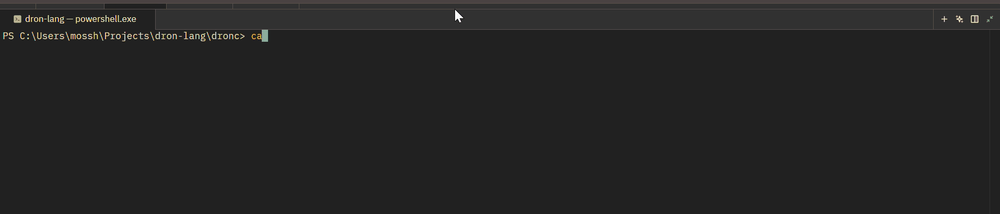

# ***THE DRON COMPILER***
Hello everyone, this is *Dron*, a compiled language built alongside my kernel. 

## DEMO

>[!TIP]
>The blue is the token vector output after lexing. The green is the AST tree after parsing.

>[!NOTE]
>This is at the parser, still implementing the other layers.
### Why??
Coz i needed it for my kernel and other languages lack, 
or u need to go through hours of docs and tutorials for what i may need. 

### File Structure 
- `dronc/` - the compiler, written in Rust
- `lang-syntax/` - example Dron source files
- `tests/` - test scripts
### Try it for yourself
```
  cd dronc
  cargo run -- ../lang-syntax/main.rn
```
> File being used (main.rn)
```
  fn foo(x:i32,y:i32){}
  fn faa() {}
  struct ParseError {
    blocks: BlockStuff,
    keywords: KeywordStuff,
  }

```
